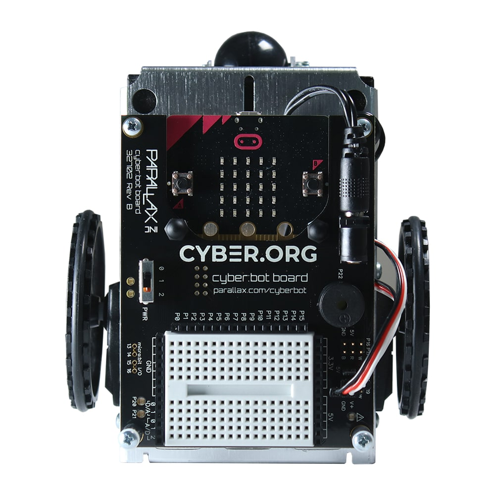

# Cyberbot

Cyberbot is a robot car project designed for educational purposes, exploration, and experimentation with robotics and programming.

## Table of Contents

- [Introduction](#introduction)
- [Features](#features)
- [Getting Started](#getting-started)
- [Usage](#usage)
- [Programming](#programming)
- [Contributing](#contributing)
- [License](#license)

## Introduction

Cyberbot is a versatile robot car that serves as a platform for learning and experimenting with robotics and programming. Whether you are a beginner or an experienced enthusiast, Cyberbot provides a hands-on experience in building and programming a robot car.

## Features

- **Modular Design:** Easy assembly with modular components.
- **Sensors:** Equipped with sensors for obstacle detection and line following.
- **Expandable:** Provides expansion options for adding additional modules or features.
- **Educational:** Designed to facilitate learning in robotics, programming, and electronics.

## Getting Started

## Usage

For a comprehensive guide on using and configuring Cyberbot, Parallax offers an excellent resource. You can explore step-by-step tutorials and valuable information at the [Parallax Cyberbot Learning Hub](https://learn.parallax.com/tutorials/cyberbot). Whether you're a beginner or an enthusiast, this resource provides insights into effectively utilizing and setting up your Cyberbot.

## License

This project is licensed under the terms of the [GNU General Public License (GPL) version 3.0](LICENSE).

You can find a copy of the license in the [LICENSE](LICENSE) file included with this distribution.
